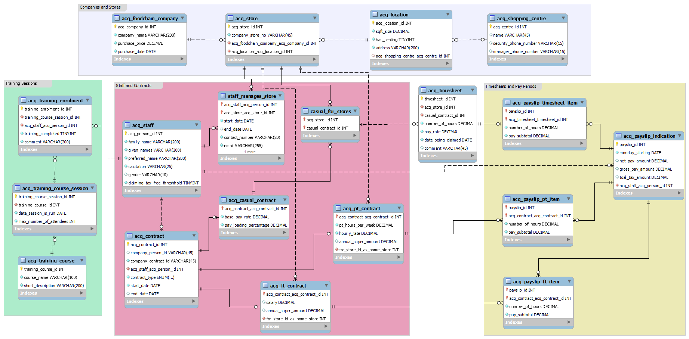

# Database for Acquisition Co

## Introduction 
Acquisition Co, an investment company, has been acquiring several fast-food brands to establish a diversified portfolio of companies, staff, sales, locations, and stock. They seek to develop a robust system capable of managing the addition, removal, and updating of details about the acquired brands.

### Food Chain Company
A food chain company, owned by Acquisition Co, is the primary focus. Details of interest include the acquisition date, purchase amount, company name, and a unique identifier assigned by Acquisition Co. Each company may operate multiple physical stores, each with a unique ID assigned by Acquisition Co or by the company itself. The acquired companies may utilize the same or different identifier schemes.

### Shopping Centre Locations and Other Locations
Each store may be located in a standalone location or within a larger shopping center. The system should record location details such as address, size, and seating availability. For shopping centers, additional information like the center's name, security office contact, and center manager details should be captured. A store must be associated with only one location, while a location can host multiple stores.

### Staff and Contracts
Acquisition Co aims to manage current staff across all stores and chains. Staff may have contracts with individual stores or across multiple stores/chains. Each staff member is assigned a unique ID by Acquisition Co. Contract types include full-time, part-time, or casual, each with specific attributes such as salary, hourly pay rate, and superannuation details. Staff members may also serve as store managers, with separate details including contact information and performance review dates.

## Overview
This project comprises two parts:

- Part 1: Acquisition Co requires reports on various aspects of the database, such as non-shopping center locations or casual staff contact directory and many more.
 [Acquisition Co Data Analysis Questions & Answers](./tasks/task1.md)

- Part 2: Acquisition Co aims to integrate timesheets, payments, and a new paid training program into a new payment tracking system. This involves adding functionality to the database to support business rules related to integrated timesheets, pays, and training programs.
 [Acquisition Co Functions and Stored Procedures](./tasks/task2.md)

## Entity Relationship Diagram

